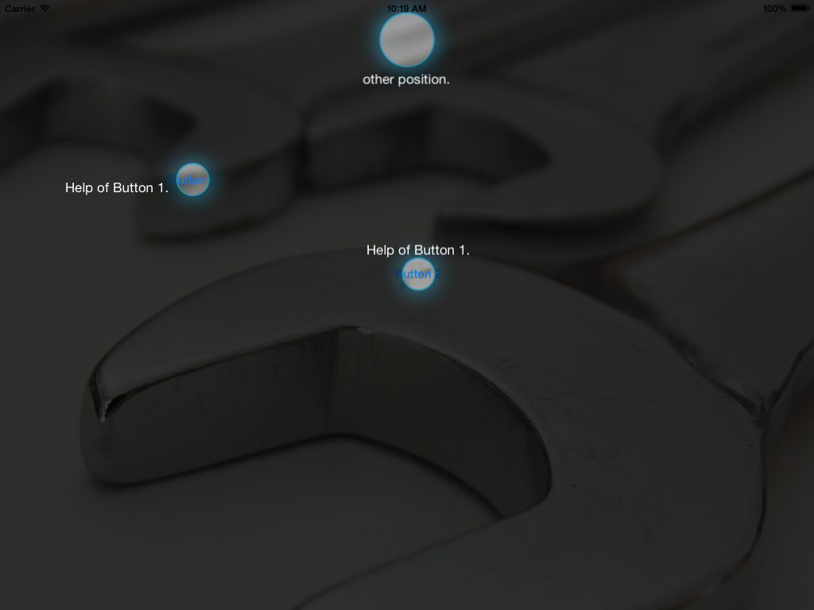

# FVEasyShowCase
ShowCase for ios that allows show multiple points in the same screen (inspired in [iShowCase](https://github.com/rahuliyer95/iShowcase))

##Installation:
###CocoaPods:

    pod "FVEasyShowCase", "~> 1.0"

##example of use:

    FVEasyShowCase *helpView = [[FVEasyShowCase alloc] init];
    [helpView setDelegate:self];
    [helpView setContainerView:self.view];
    [helpView addPoint:[[FVEasyShowCasePoint alloc] initWithTarget:button1 inContainer:self.view text:@"Help of Button 1." labelPosition:FVEasyShowCasePointPositionLeft]];
    [helpView addPoint:[[FVEasyShowCasePoint alloc] initWithLocation:CGRectMake(self.view.frame.size.width/2-50, 0, 100, 100) text:@"other position." labelPosition:FVEasyShowCasePointPositionBot]];
    [helpView addPoint:[[FVEasyShowCasePoint alloc] initWithTarget:button2 inContainer:self.view text:@"Help of Button 1." labelPosition:FVEasyShowCasePointPositionTop]];
    
    [helpView setupShowcase];
    [helpView show];
    
remember add the FVEasyShowCaseDelegate and the functions:
    
    -(void)FVEasyShowCaseDismissed
    {
    
    }

    -(void)FVEasyShowCaseShown
    {
    
    }
    
    
## Screenshots

## Author

Fernando Valle, fernandovalle.developer@gmail.com

## License

FVEasyShowCase is available under the MIT license. See the LICENSE file for more info.
